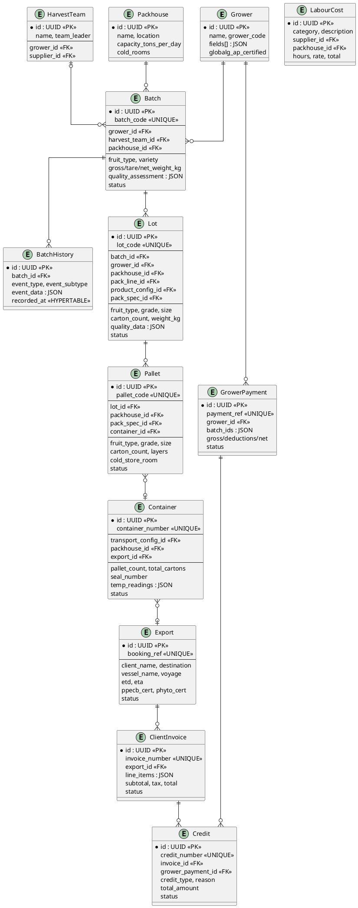

# FruitPAK — Entity Relationship Diagram

## Fruit Flow (harvest → export)

```
                          ┌──────────────────────┐
                          │       Grower          │
                          │ name, grower_code,    │
                          │ fields[], certif.     │
                          └──────────┬───────────┘
                                     │ 1
                                     │
                          ┌──────────▼───────────┐
                          │    HarvestTeam        │
                          │ name, leader, size    │◄──── Supplier (labour)
                          │ fruit_types[]         │
                          └──────────┬───────────┘
                                     │ 0..1
                                     │
  ┌───────────┐           ┌──────────▼───────────┐
  │ Packhouse │ 1 ◄───────│       Batch           │
  │ name,     │           │ batch_code (GRN)      │
  │ location, │           │ gross/tare/net_kg     │
  │ cold_rooms│           │ quality_assessment{}  │
  └─────┬─────┘           │ status: received →    │
        │                 │   grading → packing → │
        │                 │   complete            │
        │                 └──────────┬───────────┘
        │                            │ 1
        │                   ┌────────┴────────┐
        │                   │    1..*          │
        │        ┌──────────▼───────────┐     │
        │        │        Lot           │     │
        │ 1 ◄────│ lot_code, grade,     │     │
        │        │ size, fruit_type,    │     │
        │        │ pack_spec, cartons   │     │
        │        │ quality_data{}       │     │
        │        └──────────┬───────────┘     │
        │                   │ 1               │
        │                   │                 │
        │        ┌──────────▼───────────┐     │
        │ 1 ◄────│       Pallet         │     │
        │        │ pallet_code, grade,  │     │    ┌──────────────┐
        │        │ cartons, layers,     │     │    │  PackSpec     │
        │        │ cold_store_room,     │◄────┘    │ name, type,  │
        │        │ net/gross_weight_kg  │          │ weight_kg,   │
        │        └──────────┬───────────┘          │ cartons/layer│
        │                   │ 0..1                 │ layers/pallet│
        │                   │                      └──────────────┘
        │        ┌──────────▼───────────┐
        │ 0..1◄──│     Container        │
        │        │ container_number,    │     ┌────────────────┐
        │        │ seal_number,         │◄────│TransportConfig │
        │        │ pallet_count,        │     │ temp, capacity │
        │        │ temp_readings[]      │     └────────────────┘
        │        └──────────┬───────────┘
        │                   │ 0..1
        │                   │
        │        ┌──────────▼───────────┐
        │        │       Export         │
        │        │ booking_ref,         │
        │        │ client, destination, │
        │        │ vessel, ETD/ETA,     │
        │        │ PPECB, phyto certs   │
        │        └──────────────────────┘
        │
  ──────┘

                    ┌──────────────────────────────────────────┐
                    │            BatchHistory                   │
                    │ (immutable event log — TimescaleDB)       │
                    │ batch_id → Batch                         │
                    │ event_type: intake|grading|packing|       │
                    │   cold_storage|loading|export|rejected    │
                    │ event_data{}, recorded_at (hypertable PK)│
                    └──────────────────────────────────────────┘
```

## Financial Models

```
  ┌──────────────────┐          ┌──────────────────┐
  │  GrowerPayment   │          │  ClientInvoice   │
  │ payment_ref      │          │ invoice_number   │
  │ grower_id →      │          │ client_name      │
  │ batch_ids[]      │          │ export_id →      │
  │ gross/deductions │          │ line_items[]     │
  │ net_amount       │          │ subtotal/tax/    │
  │ rate_per_kg      │          │ total/balance    │
  │ status: pending →│          │ status: draft →  │
  │  approved → paid │          │  issued → paid   │
  └───────┬──────────┘          └───────┬──────────┘
          │                             │
          │ 0..*                        │ 0..*
          ▼                             ▼
  ┌──────────────────────────────────────────────┐
  │                  Credit                       │
  │ credit_number                                 │
  │ credit_type: client_credit | grower_credit    │
  │ reason: quality_claim | short_delivery | ...  │
  │ invoice_id → | grower_payment_id →            │
  │ line_items[], total_amount                    │
  │ status: draft → issued → applied              │
  └───────────────────────────────────────────────┘

  ┌──────────────────┐
  │   LabourCost     │
  │ category:        │
  │  packing|harvest │
  │  |cold_store|... │
  │ supplier_id →    │
  │ packhouse_id →   │
  │ hours, rate,     │
  │ headcount, total │
  │ extras{}         │
  └──────────────────┘
```

## FK Summary Table

| Child Table      | FK Column            | → Parent Table     | Cardinality |
|------------------|----------------------|--------------------|-------------|
| Batch            | grower_id            | Grower             | N:1         |
| Batch            | harvest_team_id      | HarvestTeam        | N:1         |
| Batch            | packhouse_id         | Packhouse          | N:1         |
| BatchHistory     | batch_id             | Batch              | N:1         |
| BatchHistory     | packhouse_id         | Packhouse          | N:1         |
| BatchHistory     | pack_line_id         | PackLine           | N:1         |
| Lot              | batch_id             | Batch              | N:1         |
| Lot              | grower_id            | Grower             | N:1         |
| Lot              | packhouse_id         | Packhouse          | N:1         |
| Lot              | pack_line_id         | PackLine           | N:1         |
| Lot              | product_config_id    | ProductConfig      | N:1         |
| Lot              | pack_spec_id         | PackSpec           | N:1         |
| Pallet           | lot_id               | Lot                | N:1         |
| Pallet           | packhouse_id         | Packhouse          | N:1         |
| Pallet           | pack_spec_id         | PackSpec           | N:1         |
| Pallet           | container_id         | Container          | N:1         |
| Container        | transport_config_id  | TransportConfig    | N:1         |
| Container        | packhouse_id         | Packhouse          | N:1         |
| Container        | export_id            | Export             | N:1         |
| GrowerPayment    | grower_id            | Grower             | N:1         |
| ClientInvoice    | export_id            | Export             | N:1         |
| Credit           | invoice_id           | ClientInvoice      | N:1         |
| Credit           | grower_payment_id    | GrowerPayment      | N:1         |
| Credit           | export_id            | Export             | N:1         |
| LabourCost       | supplier_id          | Supplier           | N:1         |
| LabourCost       | packhouse_id         | Packhouse          | N:1         |
| LabourCost       | pack_line_id         | PackLine           | N:1         |
| LabourCost       | harvest_team_id      | HarvestTeam        | N:1         |

## PlantUML (paste into plantuml.com)


